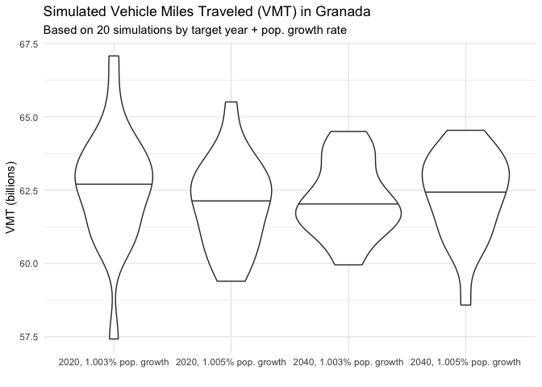

Assignment 5
================
Erik Strand
11.14.2021

``` r
knitr::opts_chunk$set(
  error = FALSE,
  message = FALSE,
  warning = FALSE,
  cache = TRUE
)
```

``` r
library(tidyverse)
library(sf)
library(tidygraph)
```

``` r
vmt_sim <- function(pop, year, growth, ownership){
    bldgs_temp <- 
      bldgs %>% 
      slice_sample(prop = 0.5)
    bldg_pop <- 
      bldgs_temp %>% 
      mutate(
        new_pop = (Bldg_pop * (growth ^ (year - 2015))), 
        new_pop = ifelse(is.na(new_pop), Bldg_pop, new_pop)
      ) %>% 
      select(nodeID, Bldg_pop, new_pop, vmt_min) %>% 
      mutate(
        vmt = vmt_min * (pop / ownership) * (5 * 2 * 50)
      )
      
    vmt_final <- 
      bldg_pop %>% 
      ungroup() %>% 
      summarize(vmt = sum(vmt, na.rm = T)) %>% 
      pull(vmt)
  
    return(vmt_final)
}
```

``` r
distance_mi <- function(start, end){
  path <- igraph::shortest_paths(
    graph = graph,
    from = start,
    to = end,
    out = "both",
    weights = graph %>% activate(edges) %>% pull(length)
  )
  
  path_graph <- graph %>% 
    igraph::subgraph.edges(eids = path$epath %>% unlist()) %>% 
    as_tbl_graph()
  
  distance <- path_graph %>% activate(edges) %>% 
    pull(length) %>% sum()
  
  distance_mi <- 
    distance * 0.000621371 # converts meters to miles
  
  return(distance_mi)
}
```

``` r
stgeorge_grenville <- read_sf("../Data/St George's & Grenville")
my_crs <- st_crs(stgeorge_grenville)
grenada <- read_sf("../Data/Grenada") %>% st_transform(crs = my_crs)
roads <- read_sf("../Data/Roads") %>% st_transform(crs = my_crs)
buildings <- read_sf("../Data/Buildings") %>% st_transform(crs = my_crs)
densification <- 
    read_sf("../Data/Densification map") %>% 
    filter(Area > 300) %>% 
    st_transform(crs = my_crs)
```

``` r
edges <- roads %>% 
    mutate(edgeID = 1:n()) %>% 
    select(edgeID)

nodes <- edges %>% 
    st_coordinates() %>% 
    as_tibble() %>% 
    rename(edgeID = L1) %>% 
    group_by(edgeID) %>% 
    slice(c(1, n())) %>% 
    ungroup() %>% 
    mutate(start_end = rep(c('start', 'end'), times= n()/2))

nodesID <- nodes %>% 
    mutate(xy = paste(X,Y)) %>% 
    mutate(nodeID = group_indices(., factor(xy, levels = unique(xy)))) %>% 
    select(-xy)

source_nodes <- nodesID %>% 
    filter(start_end == 'start') %>% 
    select(edgeID, nodeID)

target_nodes <- nodesID %>% 
    filter(start_end == 'end') %>% 
    select(edgeID, nodeID)

edgesJoin <- edges %>% 
    left_join(source_nodes) %>% 
    rename(from = nodeID) %>% 
    left_join(target_nodes) %>% 
    rename(to = nodeID)

nodesCleaned <- nodesID %>% 
    distinct(nodeID, .keep_all = TRUE) %>% 
    select(-c(edgeID, start_end)) %>% 
    st_as_sf(coords = c("X", "Y")) %>% 
    st_set_crs(st_crs(edges))
```

``` r
townCenters <- tibble(cities = c("St George", "Grenville", "church"),
                      lat = c(12.0158163,12.1224946, 12.1201713),
                      long = c(-61.7583487,-61.6248177,-61.62752))

townCentersSF <- st_as_sf(townCenters, 
                          coords = c("long","lat"),
                          crs = 4326) %>% 
    st_transform(my_crs)

origin <- buildings %>% 
    st_centroid() %>%
    st_coordinates() %>% 
    matrix(ncol = 2)
    

destination <- townCentersSF %>% 
    st_coordinates() %>% 
    matrix(ncol=2)
```

``` r
graph <- tbl_graph(nodes = nodesCleaned,
                   edges = as_tibble(edgesJoin),
                   directed = FALSE)

graph <- graph %>% activate(edges) %>% 
    mutate(length = st_length(geometry))

allCoords <- graph %>% 
    activate(nodes) %>% 
    as_tibble() %>% 
    st_as_sf() %>% 
    st_coordinates()
```

``` r
origin_index <- nabor::knn(data = allCoords, query = origin, k = 1)

destination_index <- nabor::knn(data = allCoords, query = destination, k = 1)

originNode <- nodesCleaned[origin_index$nn.idx,]
destinationNode <- nodesCleaned[destination_index$nn.idx,]
```

``` r
bldgs <- 
  originNode %>%
  st_intersection(stgeorge_grenville) %>% 
  st_drop_geometry() %>% 
  left_join(buildings, by = c("nodeID" = "OBJECTID")) %>% 
  mutate(
    st_george = destinationNode$nodeID[1], 
    grenville = destinationNode$nodeID[2]
  ) %>% 
  group_by(nodeID, st_george, grenville) %>% 
  summarize(
    Bldg_pop = sum(Bldg_pop), 
    bldgs = n()
  ) %>% 
  ungroup() %>% 
  rowwise() %>% 
  mutate(
    vmt_st_george = distance_mi(nodeID, st_george), 
    vmt_grenville = distance_mi(nodeID, grenville), 
    vmt_min = pmin(vmt_st_george, vmt_grenville)
  ) %>% 
  ungroup()

vmt_inputs <- 
  tibble(
    pop = rep(106823, 80), 
    year = c(rep(2020, 40), rep(2040, 40)), 
    growth = c(rep(1.003, 20), rep(1.005, 20), rep(1.003, 20), rep(1.005, 20)),
    ownership = rep(1, 80)
  )

vmt_simulations <- 
  pmap_dbl(vmt_inputs, vmt_sim)

vmt <- 
  vmt_inputs %>% 
  cbind(vmt_simulations) %>% 
  mutate(vmt_simulations = vmt_simulations * 2)
```

``` r
vmt %>% 
  mutate(
    group = paste0(year, ", ", growth, "% pop. growth"), 
    vmt_bill = vmt_simulations / 1000000000
  ) %>% 
  ggplot(aes(x = group, y = vmt_bill)) + 
  geom_violin(draw_quantiles = 0.5) + 
  theme_minimal() + 
  labs(
    title = "Simulated Vehicle Miles Traveled (VMT) in Granada", 
    subtitle = "Based on 20 simulations by target year + pop. growth rate", 
    x = "", 
    y = "VMT (billions)"
  )
```

<!-- -->

``` r
vmt_avg <- 
  vmt %>% 
  group_by(year, growth, ownership) %>% 
  summarize(avg_vmt = mean(vmt_simulations))

vmt_avg %>% 
  knitr::kable()
```

| year | growth | ownership |    avg\_vmt |
|-----:|-------:|----------:|------------:|
| 2020 |  1.003 |         1 | 62640581403 |
| 2020 |  1.005 |         1 | 62061091109 |
| 2040 |  1.003 |         1 | 62185394036 |
| 2040 |  1.005 |         1 | 62334129591 |
