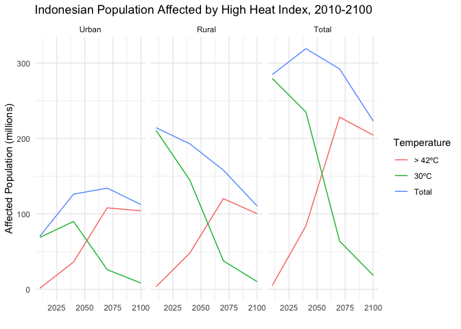

Module 1
================
Erik Strand
10.10.2021

``` r
knitr::opts_chunk$set(
  error = FALSE,
  message = FALSE,
  warning = FALSE, 
  cache = TRUE
)
```

``` r
library(tidyverse)
library(sf)
library(raster)
library(tmap)
library(stars)
```

``` r
findAffectedPop <- function(boundaries, country, heat, pop, urban, year) {
    heat <- raster(heat)
    pop <- raster(pop)
    urban <- raster (urban)
    countries <- read_sf(boundaries)
    clip_extent <- countries %>% filter(ADMIN == country)
    
    heat_crop <-  crop(heat, clip_extent)
    
    tm_shape(heat_crop) +
        tm_raster()  +
        tm_shape(clip_extent) +
        tm_borders()
    
    pop_crop <- crop(pop, clip_extent)
    urban_crop <- crop(urban, clip_extent)
    
    heat_crop_resample <- resample(heat_crop, pop_crop)
    
    fact <- res(heat)[1]/res(pop)[1]
    
    heat_crop_disagg <- raster::disaggregate(heat_crop, fact  = fact)

    mercator <- "+proj=merc +a=6378137 +b=6378137 +lat_ts=0.0 +lon_0=0.0 +x_0=0.0 +y_0=0 +k=1.0 +units=m +nadgrids=@null +wktext  +no_defs"
    heat_raster  <- heat_crop_resample  %>% projectRaster(crs = mercator)
    pop_raster <- pop_crop  %>% projectRaster(crs = mercator)
    urban_raster <- urban_crop %>% projectRaster(crs = mercator)
    
    heat_raster_reclass <- heat_raster
    heat_raster_reclass[heat_raster < 30] <- 0
    heat_raster_reclass[heat_raster >= 30] <- 1
    
    heat_raster_reclass_high <- heat_raster
    heat_raster_reclass_high[heat_raster < 42] <- 0
    heat_raster_reclass_high[heat_raster >= 42] <- 1
    
    urban_reclass <- urban_raster
    urban_reclass[urban_reclass < 2] <- 0
    urban_reclass[urban_reclass >= 2] <- 1
    
    rural_reclass <- urban_raster
    rural_reclass[rural_reclass < 2] <- 1
    rural_reclass[rural_reclass >= 2] <- 0
    
    heat_pop_all <- heat_raster_reclass * pop_raster
    heat_pop_high <- heat_raster_reclass_high * pop_raster
    
    pop_affected_total <- sum(values(heat_pop_all),na.rm=TRUE)
    pop_affected_high <- sum(values(heat_pop_high),na.rm=TRUE)
    pop_affected_low <- pop_affected_total - pop_affected_high
    
    heat_pop_urban_high <- heat_pop_high * urban_reclass
    heat_pop_rural_high <- heat_pop_high * rural_reclass
    heat_pop_urban_low <- heat_pop_all * urban_reclass
    heat_pop_rural_low <- heat_pop_all * rural_reclass
    
    pop_affected_urban_high <- sum(values(heat_pop_urban_high),na.rm=TRUE)
    pop_affected_rural_high <- sum(values(heat_pop_rural_high),na.rm=TRUE)
    pop_affected_urban <- sum(values(heat_pop_urban_low),na.rm=TRUE)
    pop_affected_rural <- sum(values(heat_pop_rural_low),na.rm=TRUE)
    pop_affected_urban_low <- pop_affected_urban - pop_affected_urban_high
    pop_affected_rural_low <- pop_affected_rural - pop_affected_rural_high
    
    heat_pop_map <-  
    mask(heat_pop_all, clip_extent %>% sf::st_transform(mercator))
    
    tm_shape(heat_pop_map) + 
        tm_raster()
    
    results <- tribble(
        ~Area, ~Year, 
        "Urban", pop_affected_urban, 
        "30ºC", pop_affected_urban_low, 
        "> 42ºC", pop_affected_urban_high, 
        "Rural", pop_affected_rural, 
        "30ºC", pop_affected_rural_low, 
        "> 42ºC", pop_affected_rural_high, 
        "Total", pop_affected_total, 
        "30ºC", pop_affected_low, 
        "> 42ºC", pop_affected_high, 
    ) %>% 
        rename_at(vars(Year), ~ paste0(year))
    
    return(results)
}
```

``` r
arguments <- 
    tibble(
        boundaries = "../Data/Nations", 
        country = "Indonesia",
        heat = 
            c(
                "../Data/Temp/Global_Heatindex_GFDL-ESM2M+RCP8p5-RMean05_30min_aLTMax1950-2009.tif",
                "../Data/Temp/Global_Heatindex_GFDL-ESM2M+RCP8p5-RMean05_30min_aLTMax2010-2039.tif",
                "../Data/Temp/Global_Heatindex_GFDL-ESM2M+RCP8p5-RMean05_30min_aLTMax2040-2069.tif",
                "../Data/Temp/Global_Heatindex_GFDL-ESM2M+RCP8p5-RMean05_30min_aLTMax2070-2099.tif"
            ),
        pop = 
            c(
                "../Data/Population/popmean-2010.tiff",
                "../Data/Population/popmean-2040.tiff",
                "../Data/Population/popmean-2070.tiff",
                "../Data/Population/popmean-2100.tiff"
            ),
        urban = 
            c(
                "../Data/Urban/urbanization-2010.tiff",
                "../Data/Urban/urbanization-2040.tiff",
                "../Data/Urban/urbanization-2070.tiff",
                "../Data/Urban/urbanization-2100.tiff"
            ),
        year = 
            c(
                "Current", 
                "2040", 
                "2070", 
                "2100"
            ) 
    )
```

``` r
results <- 
    pmap_dfc(
        arguments,
        findAffectedPop
    )
```

``` r
results <- 
    tibble(results) %>% 
    dplyr::select(
        area = Area...1, 
        Current, 
        `2040`, 
        `2070`, 
        `2100`
    )

knitr::kable(results)
```

| area      |   Current |      2040 |      2070 |      2100 |
|:----------|----------:|----------:|----------:|----------:|
| Urban     |  70291845 | 126118434 | 134138561 | 112405830 |
| 30ºC      |  68835618 |  89959520 |  26110264 |   8363369 |
| &gt; 42ºC |   1456227 |  36158913 | 108028297 | 104042461 |
| Rural     | 214253125 | 192901293 | 157923867 | 110515374 |
| 30ºC      | 210744118 | 145037797 |  37733175 |  10229333 |
| &gt; 42ºC |   3509007 |  47863496 | 120190692 | 100286041 |
| Total     | 284544970 | 319019727 | 292062429 | 222921204 |
| 30ºC      | 279579736 | 234997317 |  63843439 |  18592702 |
| &gt; 42ºC |   4965234 |  84022409 | 228218990 | 204328502 |

``` r
results_tidy <- 
    results %>% 
    mutate(
        geography = 
            ifelse(stringr::str_detect(area, "\\d"), NA_character_, area), 
        temp = 
            ifelse(stringr::str_detect(area, "\\d"), area, NA_character_), 
        temp = ifelse(is.na(temp), "Total", temp)
    ) %>% 
    fill(geography) %>% 
    pivot_longer(
        cols = "Current":"2100", 
        names_to = "year", 
        values_to = "affected_pop"
    ) %>% 
    mutate(
        year_int = as.integer(ifelse(str_detect(year, "\\d"), year, 2010))
    ) %>% 
    dplyr::select(-area)

results_tidy %>% 
    ggplot(aes(x = year_int, y = affected_pop / 1000000, color = temp)) + 
    geom_line() + 
    facet_grid(
        ~factor(geography, levels = c("Urban", "Rural", "Total"))
    ) + 
    scale_y_continuous(labels = scales::label_number()) + 
    labs(
        x = "", 
        y = "Affected Population (millions)", 
        color = "Temperature", 
        title = "Indonesian Population Affected by High Heat Index, 2010-2100"
    ) + 
    theme_minimal()
```

<!-- -->
