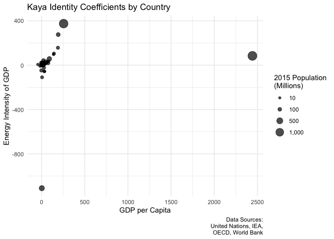
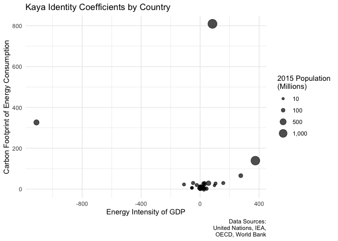
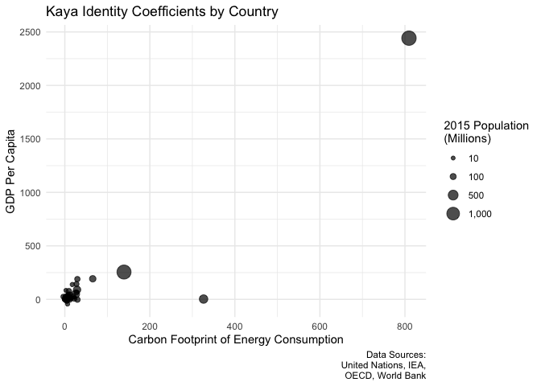

Module 2
================
Erik Strand
10.24.2021

``` r
knitr::opts_chunk$set(
  error = FALSE,
  message = FALSE,
  warning = FALSE, 
  cache = TRUE
)
```

``` r
library(tidyverse)
library(janitor)
library(readxl)
```

``` r
country_codes <- 
    read_csv("../data/Country_codes/Country_codes_2020.csv", na = c("#N/A", "")) %>% 
    clean_names() %>% 
    select(un_country, world_bank_country, iea_country, iso3) 

tpes <- read_xlsx("../Data/Energy/TPES_by_source.xlsx",
                  sheet = "Total", skip = 5) %>% 
    clean_names() %>% 
    slice(-1) %>% 
    select(-x2) %>% 
    mutate_at(vars(-time),as.numeric) %>% 
    rename(country = time) %>% 
    left_join(country_codes, by = c("country"= "iea_country"))

coal <- read_xlsx("../Data/Energy/TPES_by_source.xlsx", 
                  sheet="Coal", skip = 5) %>% 
    clean_names() %>% 
    slice(-1) %>% 
    select(-x2) %>% 
    mutate_at(vars(-time),as.numeric) %>% 
    rename(country = time) %>% 
    mutate_at(vars(-country), function(x) x * 25.4 * 3.67) %>% 
    pivot_longer(-country, names_to = "year", values_to = "coal") %>% 
    mutate(year = stringr::str_remove(year, "x"),
           year = as.numeric(year))

natural_gas <- read_xlsx("../Data/Energy/TPES_by_source.xlsx", 
                  sheet="Natural_gas", skip = 5) %>% 
    clean_names() %>% 
    slice(-1) %>% 
    select(-x2) %>% 
    mutate_at(vars(-time),as.numeric) %>% 
    rename(country = time) %>% 
    mutate_at(vars(-country), function(x) x * 14.1 * 3.67) %>% 
    pivot_longer(-country, names_to = "year", values_to = "natural_gas") %>% 
    mutate(year = stringr::str_remove(year, "x"),
           year = as.numeric(year))

crude_oil <- read_xlsx("../Data/Energy/TPES_by_source.xlsx", 
                  sheet="Crude", skip = 5) %>% 
    clean_names() %>% 
    slice(-1) %>% 
    select(-x2) %>% 
    mutate_at(vars(-time),as.numeric) %>% 
    rename(country = time) %>% 
    mutate_at(vars(-country), function(x) x * 19.9 * 3.67) %>% 
    pivot_longer(-country, names_to = "year", values_to = "crude_oil") %>% 
    mutate(year = stringr::str_remove(year, "x"),
           year = as.numeric(year))

tfc <- read_xlsx("../Data/Energy/TFC_by_sector.xlsx",
                 sheet = "Total_final_Consumption", skip = 5) %>%
    clean_names() %>% 
    slice(-1) %>% 
    select(-x2) %>% 
    mutate_at(vars(-time),as.numeric) %>% 
    rename_at(vars(starts_with("x")), ~ str_sub(., 2, length(.))) %>% 
    rename(country = time)

co2 <- read_csv("../Data/CO2/INT-Export-07-09-2020_16-39-18.csv",
                skip = 1) %>% 
    clean_names() %>% 
    slice(-1) %>% 
    filter(stringr::str_detect(api, "INTL.4008-8-*")) %>% 
    select(-api) %>%
    mutate_at(vars(-x2), as.numeric) %>% 
    rename(country = x2) %>% 
    rename_at(vars(starts_with("x")), ~ str_sub(., 2, length(.))) %>%
    left_join(country_codes, by = c("country" = "world_bank_country"))

pop <- 
    read_xlsx(
        "../Data/Population/WPP2017_POP_F01_1_TOTAL_POPULATION_BOTH_SEXES.xlsx",
        skip = 16
    ) %>% 
    clean_names() %>% 
    select(-c(country_code, index, variant, notes)) %>% 
    rename(country = region_subregion_country_or_area) %>% 
    rename_at(vars(starts_with("x")), ~ str_sub(., 2, length(.))) %>%
    left_join(country_codes, by = c("country" ="un_country"))

gdp <- 
    read_csv(
        "../Data/GDP/API_NY.GDP.MKTP.PP.CD_DS2_en_csv_v2_1220990.csv",
        skip = 3
    ) %>% 
    clean_names() %>% 
    select(-c(country_code, indicator_name, indicator_code, x65)) %>% 
    mutate_at(vars(-country_name), as.numeric) %>% 
    rename(country = country_name) %>% 
    rename_at(vars(starts_with("x")), ~ str_sub(., 2, length(.))) %>%
    left_join(country_codes, by = c("country" = "world_bank_country"))
```

``` r
co2_calc <- 
    coal %>% 
    left_join(natural_gas, by = c("country", "year")) %>% 
    left_join(crude_oil, by = c("country", "year")) %>% 
    mutate(
        f_coal = (coal) / 1000000,
        f_gas = (natural_gas) / 1000000,
        f_oil = (crude_oil) / 1000000
    ) %>% 
    left_join(country_codes, by = c("country" = "iea_country"))

tpes_long <- 
    tpes %>% 
    select(-c(un_country, world_bank_country, country)) %>% 
    pivot_longer(-iso3, names_to = "year", values_to = "e") %>% 
    mutate(year = stringr::str_remove(year, "x"),
           year = as.numeric(year)) %>% 
    filter(!is.na(iso3)) %>% 
    mutate(e = as.numeric(e))

co2_long <- 
    co2 %>% 
    select(-c(un_country, iea_country, country)) %>% 
    pivot_longer(-c( iso3),names_to = "year", values_to = "f_tot") %>% 
    mutate(year= stringr::str_remove(year, "x"),
           year = as.numeric(year))%>% 
    filter(!is.na(iso3))

gdp_long <- 
    gdp %>% 
    select(-c(un_country, iea_country, country)) %>% 
    pivot_longer(-c( iso3), names_to = "year", values_to = "g") %>% 
    mutate(year= stringr::str_remove(year, "x"),
           year = as.numeric(year))%>% 
    filter(!is.na(iso3))

pop_long <- 
    pop  %>% 
    select(-c(world_bank_country, iea_country, country)) %>% 
    pivot_longer(-c( iso3), names_to = "year", values_to = "p") %>% 
    mutate(year= stringr::str_remove(year, "x"),
           year = as.numeric(year))%>% 
    filter(!is.na(iso3))

combined <- 
    tpes_long %>% 
    left_join(co2_calc %>% select(iso3, year, starts_with("f")),
               by = c("year" = "year", "iso3" = "iso3")) %>% 
    left_join(gdp_long,
               by = c("year" = "year", "iso3" = "iso3")) %>% 
    left_join(pop_long,
               by = c("year" = "year", "iso3" = "iso3")) %>% 
    left_join(co2_long %>% filter(!is.na(iso3)))

complete <- 
    combined %>% 
    filter(complete.cases(.))
```

``` r
kaya_formula <- f_tot ~ p + g_p + e_g + f_e

kaya_nest <- 
    combined %>% 
    filter(iso3 != "TGO") %>% 
    mutate(g_p = g/p,
           e_g = e/g,
           f_e = f_tot/e) %>% 
    select(-c(e, f_coal, f_gas, f_oil, g)) %>% 
    filter(complete.cases(.)) %>% 
    group_by(iso3) %>% 
    nest() %>% 
    ungroup()

kaya_coefs <- function(iso3, df){
    kaya_formula <- f_tot ~ p + g_p + e_g + f_e
    kaya <- 
        df %>% 
        mutate_at(vars(-c(year, f_tot)), scale) %>% 
        filter(complete.cases(.))
    mod <- lm(formula = kaya_formula, data = kaya)
    coefs <- 
        tibble::enframe(mod$coefficients) %>% 
        mutate(iso3 = iso3)
    return(coefs)
}
    
results <- 
    map2_dfr(
        kaya_nest$iso3, 
        kaya_nest$data,
        kaya_coefs
    ) %>% 
    pivot_wider(names_from = name, values_from = value) %>% 
    left_join(
        pop %>% 
            select(iso3, pop = `2015`) %>% 
            filter(!is.na(iso3)), 
        by = "iso3"
    )

knitr::kable(results)
```

| iso3 |  (Intercept) |            p |         g\_p |          e\_g |         f\_e |         pop |
|:-----|-------------:|-------------:|-------------:|--------------:|-------------:|------------:|
| WLD  | 2.757684e+04 | -200.6366503 | 3346.0805538 | -1054.1994213 | 1018.5306078 | 7383008.820 |
| ALB  | 3.669964e+00 |    1.7195033 |    1.9671737 |     0.0285562 |    0.3385089 |    2923.352 |
| DZA  | 8.514986e+01 |   20.6758945 |   12.6222323 |     9.6990479 |   11.8385597 |   39871.528 |
| AGO  | 9.907047e+00 |    3.2829175 |    2.9987646 |     2.7270101 |    1.9315957 |   27859.305 |
| ARG  | 1.469467e+02 |   12.7461781 |   21.5809743 |     5.2144397 |    6.3279016 |   43417.765 |
| ARM  | 7.956842e+00 |   -1.4959866 |    2.8878773 |     3.4124656 |    3.2257239 |    2916.950 |
| AUS  | 3.518076e+02 |  -46.4490580 |   34.6780573 |   -56.5016100 |    5.5615849 |   23799.556 |
| AUT  | 6.881847e+01 |    2.9350913 |    4.0325076 |    -2.9732720 |    8.7443560 |    8678.657 |
| AZE  | 3.694543e+01 |   -7.3502594 |    8.7556544 |     4.1286027 |    1.8201567 |    9617.484 |
| BHR  | 2.432775e+01 |    7.5657850 |    4.3960817 |     3.7927534 |    1.0731511 |    1371.855 |
| BGD  | 3.852571e+01 |    4.3324256 |   13.7674110 |     5.4112827 |    6.1140785 |  161200.886 |
| BLR  | 6.293778e+01 |  -19.3943349 |    8.8736888 |    28.5359749 |    2.9245134 |    9485.772 |
| BEL  | 1.448273e+02 |  -47.1540716 |   83.7576543 |    36.2510168 |    2.6397543 |   11287.940 |
| BEN  | 2.487175e+00 |    0.6477471 |    0.6069180 |     0.7225217 |    1.0142552 |   10575.952 |
| BOL  | 9.998482e+00 |    1.4018475 |    2.8577295 |     1.2354833 |    1.1650767 |   10724.705 |
| BIH  | 1.324703e+01 |   -0.8418372 |    3.2382915 |     0.5185251 |    1.1052170 |    3535.961 |
| BWA  | 3.668226e+00 |    1.2051409 |    0.1878749 |     0.5702227 |    0.5725535 |    2209.197 |
| BRA  | 3.744754e+02 |   58.7579304 |   89.8725895 |    57.2308254 |   28.8027384 |  205962.108 |
| BGR  | 5.179182e+01 |    5.4189468 |    8.2460127 |     6.8884357 |    2.8677868 |    7177.396 |
| KHM  | 3.683544e+00 |    1.3347968 |    1.0650335 |     1.6010141 |    0.9753259 |   15517.635 |
| CMR  | 4.087125e+00 |    0.8353916 |    0.9547341 |     1.1221297 |    0.7470548 |   22834.522 |
| CAN  | 5.522731e+02 |  -36.2872442 |   29.6096933 |   -55.1528510 |    6.1908092 |   35949.709 |
| CHL  | 5.733086e+01 |   17.4985707 |    4.0851807 |     6.0654413 |    1.9254310 |   17762.681 |
| CHN  | 5.648046e+03 | -145.5639719 | 2441.7591847 |    83.7508198 |  809.4341346 | 1397028.553 |
| COL  | 5.832514e+01 |   12.3192217 |    9.5782380 |    15.1311518 |    4.4981944 |   48228.697 |
| CRI  | 5.524540e+00 |    1.4460384 |    0.7891876 |     0.6613562 |    0.4020572 |    4807.852 |
| HRV  | 1.997377e+01 |   -1.3875883 |    7.4275545 |     7.8042463 |    1.9035268 |    4236.016 |
| CYP  | 7.606837e+00 |    1.4792266 |    2.3395352 |     2.8781040 |    0.5108451 |    1160.985 |
| CZE  | 1.192635e+02 |   -6.3881181 |   17.6724393 |    12.7807629 |    5.7996351 |   10603.762 |
| DNK  | 5.556994e+01 |   -1.6721814 |    4.9598824 |    -3.0844487 |   14.8683993 |    5688.695 |
| DOM  | 1.553005e+01 |    7.7048674 |   -0.9276587 |     3.7133024 |    1.0746141 |   10528.394 |
| ECU  | 2.397386e+01 |    3.8792403 |    6.2362946 |     4.4965486 |    3.2922176 |   16144.368 |
| SLV  | 5.303902e+00 |    1.0637998 |    0.4578025 |     0.7636302 |    0.5695176 |    6312.478 |
| ERI  | 8.286936e-01 |    0.0568458 |    0.0694901 |     0.2283348 |    0.1899316 |    4846.976 |
| EST  | 5.949289e+00 |   -0.3302344 |    0.6521803 |     0.8659866 |    0.6126746 |    1315.321 |
| ETH  | 4.917721e+00 |    0.9860771 |    1.2395377 |     0.5952569 |    1.1871643 |   99873.033 |
| FIN  | 5.482452e+01 |   -2.8285091 |   10.7641856 |     4.5744088 |    5.0273752 |    5481.966 |
| FRA  | 4.186409e+02 |  -26.2775550 |   -2.6825168 |   -47.6448916 |   29.6491081 |   64457.201 |
| GAB  | 2.607249e+00 |    0.9560260 |    0.0570009 |     0.2999833 |    0.9166648 |    1930.175 |
| GEO  | 6.429826e+00 |    4.9051251 |    4.7162632 |     0.5450608 |    1.4507402 |    3951.524 |
| DEU  | 8.647462e+02 |    2.8736415 |   21.4067453 |    43.1277452 |    2.0166029 |   81707.789 |
| GHA  | 6.548363e+00 |    2.5845257 |    0.9901827 |     2.7484666 |    2.3707491 |   27582.821 |
| GRC  | 9.017109e+01 |    9.8049843 |   21.1114303 |    22.9591572 |    3.2786203 |   11217.800 |
| GTM  | 9.135759e+00 |    0.4811806 |    3.1266566 |     1.1389803 |    1.3692668 |   16252.429 |
| HTI  | 1.665084e+00 |    0.3829949 |    0.2203646 |     0.0629295 |    0.1549187 |   10711.061 |
| HND  | 5.601203e+00 |    0.7247984 |    1.6125530 |     0.8524654 |    0.7765000 |    8960.829 |
| HUN  | 5.668127e+01 |    1.5210592 |    4.4867502 |     0.3168371 |    7.0349654 |    9783.925 |
| ISL  | 2.681621e+00 |   -0.0613521 |    0.7418375 |     0.1325524 |    0.6102723 |     330.243 |
| IND  | 1.163835e+03 |  459.1191094 |  255.1929438 |   374.6407166 |  139.2083449 | 1309053.980 |
| IDN  | 2.956852e+02 |   53.2137986 |   49.9585491 |    27.0937397 |   25.4913702 |  258162.113 |
| IRQ  | 8.149637e+01 |   10.7971152 |   17.6484885 |    15.0917144 |    3.0980293 |   36115.649 |
| IRL  | 3.629069e+01 |    1.2660805 |   -1.4002347 |    -3.3337846 |    4.7191591 |    4700.107 |
| ISR  | 6.032425e+01 |   17.5934179 |    8.0667818 |    15.0612475 |    4.6242688 |    8064.547 |
| ITA  | 4.436844e+02 |  -19.1497502 |  189.1824435 |   156.9032082 |   29.5348875 |   59504.212 |
| JAM  | 9.975894e+00 |    0.3423373 |    2.2804060 |     2.9998433 |    0.5656909 |    2871.934 |
| JPN  | 1.283135e+03 |   96.8570667 |  192.3098648 |   275.7719619 |   65.6589685 |  127974.958 |
| JOR  | 1.695527e+01 |    2.7405236 |    4.5123158 |     2.2285316 |    1.4671210 |    9159.302 |
| KAZ  | 2.348411e+02 |  -31.9009166 |  138.4593280 |    97.1471364 |   17.5981473 |   17749.648 |
| KEN  | 9.654844e+00 |    2.0556736 |    1.6151843 |     1.0677125 |    0.5704222 |   47236.259 |
| KWT  | 6.525027e+01 |   17.6804087 |   12.0270919 |     6.0887725 |    4.4548607 |    3935.794 |
| LVA  | 8.432699e+00 |    1.9634284 |    2.2802879 |     0.1894119 |    0.5876977 |    1992.663 |
| LBN  | 1.523051e+01 |    3.1140313 |    4.7552207 |     3.9033466 |    1.1531515 |    5851.479 |
| LBY  | 4.569780e+01 |   -0.2242203 |   12.5253125 |    12.9566207 |    6.2911530 |    6234.955 |
| LTU  | 1.475668e+01 |    4.7043498 |    4.6725008 |     0.5824811 |    0.6955063 |    2931.926 |
| LUX  | 1.085508e+01 |   -2.0325105 |    2.1172414 |    -1.4267278 |    1.7486284 |     566.741 |
| MYS  | 1.339211e+02 |   22.3582031 |   46.3125105 |    19.7567179 |    8.5191273 |   30723.155 |
| MLT  | 3.919492e+00 |    2.8566377 |   -1.6181201 |     1.2918339 |    2.0524671 |     427.616 |
| MUS  | 3.723627e+00 |    0.5920614 |    0.9677317 |     0.6894426 |    0.4676158 |    1259.456 |
| MEX  | 3.978957e+02 |   79.8585014 |   -1.2135423 |    21.0034004 |    5.1720665 |  125890.949 |
| MDA  | 7.462115e+00 |    0.5453211 |    1.4998546 |     1.1235580 |    0.4946418 |    4065.980 |
| MNG  | 1.480544e+01 |   -1.0698148 |    3.1625385 |     1.5758411 |    0.0519512 |    2976.877 |
| MNE  | 2.153100e+00 |    0.0511652 |    0.2412058 |     0.3730681 |    0.4288300 |     628.178 |
| MAR  | 3.279311e+01 |    5.2086511 |    8.4627734 |     3.6499543 |    2.6936801 |   34803.322 |
| MOZ  | 2.460476e+00 |    3.0628262 |   -0.8284037 |     1.6043999 |    1.0908944 |   28010.691 |
| NAM  | 2.356555e+00 |    0.2388908 |    0.6909306 |     0.3172196 |    0.3252564 |    2425.561 |
| NPL  | 2.409921e+00 |    0.4203738 |    0.6595131 |     0.5718894 |    0.5715777 |   28656.282 |
| NLD  | 2.438534e+02 |   55.7665388 |  -43.0902941 |     6.0523828 |    6.4525207 |   16938.499 |
| NZL  | 3.477574e+01 |   11.9475109 |   -5.0367042 |     3.2008400 |    1.6155832 |    4614.532 |
| NIC  | 3.688178e+00 |    0.3327299 |    0.7992742 |     0.5961398 |    0.5773337 |    6082.035 |
| NER  | 1.487437e+00 |    0.3198196 |    0.2402663 |     0.2479745 |    0.2417650 |   19896.965 |
| NGA  | 5.888918e+01 |   16.0507145 |    4.6854849 |     3.7401792 |   10.3649965 |  181181.744 |
| NOR  | 4.065029e+01 |   -1.1132715 |   -1.9772734 |    -5.7804829 |    1.8849868 |    5199.836 |
| OMN  | 3.099960e+01 |   10.2493166 |    3.3395270 |     6.7987371 |    3.1914511 |    4199.810 |
| PAK  | 1.142433e+02 |   14.6568880 |   16.0886117 |     4.0598358 |    5.0068632 |  189380.513 |
| PAN  | 1.525930e+01 |    6.2901842 |    2.5531408 |     4.3629152 |    1.7930257 |    3969.249 |
| PRY  | 3.725955e+00 |    0.5456792 |    0.7526708 |     0.7789266 |    0.5811728 |    6639.119 |
| PER  | 3.097585e+01 |    7.9799284 |    7.7503282 |     6.8244740 |    1.1685256 |   31376.671 |
| PHL  | 6.973312e+01 |   21.6784832 |    7.2057984 |    19.8897262 |    6.0078152 |  101716.359 |
| POL  | 2.959950e+02 |   -1.2020645 |   25.0027421 |    25.4625089 |   -3.4580523 |   38265.226 |
| PRT  | 5.872247e+01 |    5.9803100 |   17.5296482 |    17.9981170 |    3.7019521 |   10418.473 |
| QAT  | 6.461300e+01 |   34.2334519 |   12.2670538 |    17.3091844 |    5.7059854 |    2481.539 |
| ROU  | 1.026377e+02 |   14.0805303 |   17.2289079 |    13.6127659 |   11.5414267 |   19876.621 |
| SAU  | 3.573237e+02 |   67.3843171 |   64.6984914 |    27.6461519 |   27.7231248 |   31557.144 |
| SEN  | 5.021371e+00 |    1.0787015 |    1.1764762 |     0.7738136 |    0.5322378 |   14976.994 |
| SRB  | 4.688682e+01 |    3.3900323 |    7.5229826 |     7.2998731 |    2.5293636 |    8851.280 |
| SGP  | 1.345071e+02 |   42.3968139 |   19.0349198 |    26.6963025 |   22.6931239 |    5535.262 |
| SVN  | 1.518375e+01 |   -1.3261955 |    4.3560967 |     2.0441604 |    1.2233283 |    2074.788 |
| ZAF  | 4.154941e+02 |   39.4782800 |   18.2679935 |     4.6571074 |    1.7022587 |   55291.225 |
| SSD  | 1.536957e+00 |    0.0972916 |    0.0235754 |            NA |           NA |   11882.136 |
| ESP  | 3.135780e+02 |    5.1580002 |  143.2666830 |   104.7020799 |   27.4460906 |   46397.664 |
| LKA  | 1.145568e+01 |    3.5616137 |    2.1789010 |     3.5970661 |    2.2497195 |   20714.040 |
| SDN  | 9.415766e+00 |    1.7128605 |    1.0606657 |     1.0524418 |    3.1932163 |   38647.803 |
| SUR  | 2.061792e+00 |    0.1470317 |    0.3832334 |     0.3955779 |    0.2506043 |     553.208 |
| SWE  | 6.087505e+01 |   -3.0967259 |    5.1899544 |     1.7300341 |    6.5570702 |    9763.565 |
| CHE  | 4.433531e+01 |   -3.6080316 |   -0.9903470 |    -4.8553558 |    1.2569449 |    8319.769 |
| TJK  | 5.347500e+00 |   -1.5141063 |    2.0651269 |     0.4527069 |    1.7381519 |    8548.651 |
| TZA  | 4.919052e+00 |    1.8099417 |   -0.0666182 |     0.7400713 |    1.8753321 |   53879.957 |
| THA  | 2.037881e+02 |    9.9264098 |   76.4075031 |    18.7301579 |    9.4800009 |   68657.600 |
| TTO  | 3.283948e+01 |    4.7359642 |   12.6171891 |     3.2508486 |    2.5620109 |    1360.092 |
| TUN  | 1.793569e+01 |    2.7385375 |    2.5844298 |     0.8261168 |    2.7312203 |   11273.661 |
| TUR  | 2.288717e+02 |   40.7385609 |   31.6898589 |     8.4265068 |    6.5423668 |   78271.472 |
| TKM  | 4.174600e+01 |    2.5730566 |   16.6142934 |     7.3543525 |   13.4689086 |    5565.284 |
| UKR  | 3.621607e+02 |  166.3952129 |    5.8225955 |  -109.4362195 |   22.5895411 |   44657.704 |
| ARE  | 1.529642e+02 |   90.9215796 |   25.7586857 |    17.7801071 |   11.6763628 |    9154.302 |
| GBR  | 5.698338e+02 |  -78.2497233 |   27.4173783 |   -22.4304308 |   19.4533506 |   65397.080 |
| USA  | 5.537134e+03 | -737.8090347 |    2.6355394 | -1110.0733547 |  326.3768744 |  319929.162 |
| URY  | 6.459872e+00 |    0.4171669 |    1.9372943 |     0.9425621 |    0.7896124 |    3431.552 |
| UZB  | 1.106677e+02 |    7.9668750 |  -16.3521408 |    -7.6149672 |    4.3952928 |   30976.021 |
| VNM  | 7.887641e+01 |   14.4125115 |   42.2180949 |    16.2223520 |   10.8075946 |   93571.567 |
| ZMB  | 2.485026e+00 |    0.9237225 |    0.0183145 |     0.3492909 |    0.5089434 |   16100.587 |
| ZWE  | 1.163093e+01 |    0.8130957 |    1.2755535 |     1.1125359 |    2.1046185 |   15777.451 |

``` r
results %>% 
    filter(!(iso3 == "WLD")) %>% 
    ggplot(aes(x = g_p, y = e_g, size = pop / 1000)) + 
    geom_point(alpha = 0.7) + 
    theme_minimal() + 
    scale_size_continuous(
        breaks = c(10, 100, 500, 1000),
        labels = scales::label_comma()
    ) +
    labs(
        title = "Kaya Identity Coefficients by Country", 
        x = "GDP per Capita", 
        y = "Energy Intensity of GDP", 
        size = "2015 Population\n(Millions)", 
        caption = "Data Sources:\nUnited Nations, IEA,\nOECD, World Bank"
    )
```

<!-- -->

``` r
results %>% 
    filter(!(iso3 == "WLD")) %>% 
    ggplot(aes(x = e_g, y = f_e, size = pop / 1000)) + 
    geom_point(alpha = 0.7) + 
    theme_minimal() + 
    scale_size_continuous(
        breaks = c(10, 100, 500, 1000),
        labels = scales::label_comma()
    ) +
    labs(
        title = "Kaya Identity Coefficients by Country", 
        x = "Energy Intensity of GDP", 
        y = "Carbon Footprint of Energy Consumption", 
        size = "2015 Population\n(Millions)", 
        caption = "Data Sources:\nUnited Nations, IEA,\nOECD, World Bank"
    )
```

<!-- -->

``` r
results %>% 
    filter(!(iso3 == "WLD")) %>% 
    ggplot(aes(x = f_e, y = g_p, size = pop / 1000)) + 
    geom_point(alpha = 0.7) + 
    theme_minimal() + 
    scale_size_continuous(
        breaks = c(10, 100, 500, 1000),
        labels = scales::label_comma()
    ) +
    labs(
        title = "Kaya Identity Coefficients by Country", 
        x = "Carbon Footprint of Energy Consumption", 
        y = "GDP Per Capita", 
        size = "2015 Population\n(Millions)", 
        caption = "Data Sources:\nUnited Nations, IEA,\nOECD, World Bank"
    )
```

<!-- -->

Based on this Kaya Identity analysis, we can see that the coefficients
of all three principal inputs (GDP per Capita, Energy Intensity of the
GDP, Carbon Footprint of Energy Consumption) are positive, indicating
that each input has a generally positive relationship with the given
country’s Kaya identity value. In other words, increases in each
individual component are also correlated with an increase in the Kaya
identity. This is intuitive given the multiplicative nature of the Kaya
identity formula.

In general, there tends to be a positive linear relationship between any
two of these Kaya identity coefficients. For example, as the influence
of a country’s GDP per capita on its carbon emissions increases, so too
does the influence of the energy intensity of the GDP. This is also an
intuitive conclusion, although it does reveal the important fact that
none of the Kaya identity inputs offset increases in the others - all of
the inputs contribute to an increase in total carbon emissions.

However, the linear relationship between coefficient pairs are not
created equal. For example, the energy intensity of the GDP increases
rapidly in relation to the GDP per capita, but more slowly in relation
to the carbon footprint of energy consumption. Likewise, the influence
of the GDP per capita on carbon output increases somewhat slower than
the influence of the carbon footprint of energy consumption. These
unequal relationships tell us that interventions in certain areas may be
more effective at lowering carbon emissions.
